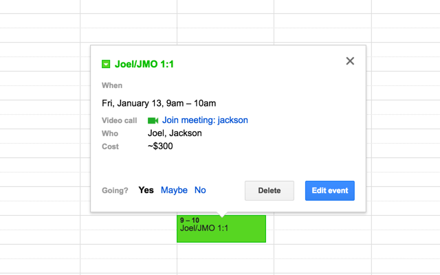

# timecost
A [Chrome extension](https://chrome.google.com/webstore/detail/timecost/cifjcccblkmebbpjcccleolaiigagpmf) for showing the real cost of meetings.

## What Is It?
Meetings cost time, and time costs money. Timecost is a simple tool to surface that cost to encourage shorter, smaller meetings. Timecost surfaces this cost by multiplying an hourly rate (either an individual's or a company average) by the length of a meeting and the number of attendees. Timecost currently works with Google Calendar, and support for other calendar apps is not planned.

## How Do I Use It?
1. Install the extension [here](https://chrome.google.com/webstore/detail/timecost/cifjcccblkmebbpjcccleolaiigagpmf)
2. Set an hourly rate in options (default is $10/hour). If you're a freelancer or work independently, this can just be your hourly rate. If you work at a company, this should be the average hourly cost of an employee. Bonus points if you include benefits + equity + payroll tax.
3. Refresh Google Calendar and see meeting costs in both the event preview

## What's Left To Do?
1. Make timecost work for all-day events
2. Add option about whether to include the cost of other attendees or not
3. Add option about whether to include maybe and awaiting guests in the event count
4. Add option about whether to filter attendees without email addresses or not (current behavior is to, to filter out conference rooms)
5. Show timecost when creating an event from main calendar view
6. Figure out if moment.js with locales is necessary or not
